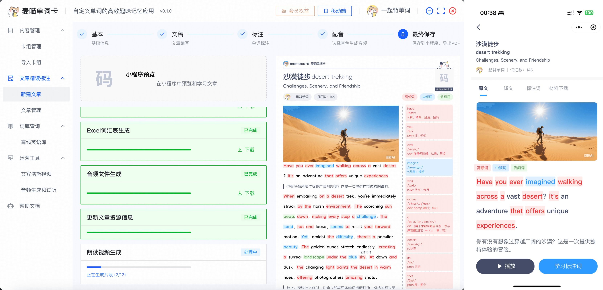

# 麦喵单词卡 AI 学习模式

## 介绍

「麦喵单词卡」是一个「支持自定义单词内容」的单词学习工具（小程序及电脑端），支持不同的语种单词学习。

1. 单词数据：提供「批量导入」、「纸质版扫描」、「手动录入」、「AI 生成」、「HTTP OPEN API 创建」等方式录入单词数据。
2. 学习模式：拥有「多人 PK 对战」、「卡片认读」、「单词听写」、「配对消除」等学习模式。
3. 学习小组：学生管理、学习打卡记录、生词统计、学习积分兑换礼品等。

基于以上功能和平台，我们的**核心愿景**:是：让每个用户都能使用 AI 创建个性化的单词学习模式。

## 快速上手

**无需懂任何的代码开发能力**，使用任意的 AI LLM 大模型进行生成，平台提供「提示词生词工具/智能体助手」及「学习模式服务部署上线能力」。

## 方案一：基于 AI 编程开发工具

更加专业 (安装使用超级简单) 且高效，需要使用电脑及安装 AI 编程软件。

1. 下载并安装 [Trae](https://www.trae.cn/)，免费使用「豆包」、「DeepSeek」、「Kimi」等大模型 AI 能力。
2. 点击 [这里](https://s.trae.com.cn/a/f79583) 获取「麦喵单词卡 - 学习模式开发助手」智能体。

## 方案二：基于 LLM 对话

提供提示词生成工具，复制发送给 LLM AI (豆包、DeepSeek 等) 生成学习模式。优势在于无需下载任何电脑软件，使用浏览器即可生成学习模式。

## 合作

我们欢迎任何形式的合作，包括但不限于：

- 麦喵同款小程序私有化部署（打造自己的单词品牌应用）
- 基于「麦喵」进行自定义录入单词内容，单词带背、小组学习
- 基于 AI 创建自己的单词学习模式，提供给其他用户使用（老师 -> 学生，家长 -> 神兽）